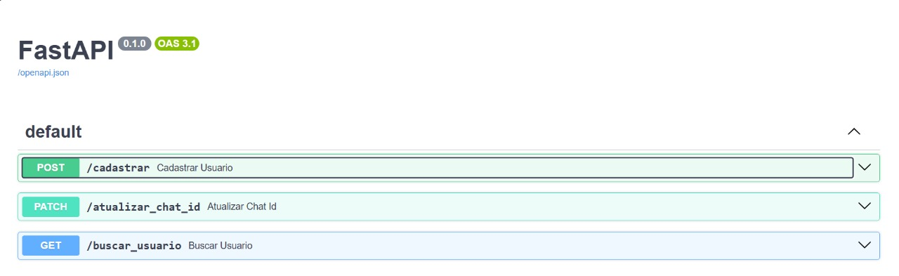

# Talpetinho API - V1.0.0 - 2025



API desenvolvida em FastAPI para cadastro, consulta e atualização de usuários com validação de dados e integração com webhook do n8n para envio de notificações.

---

## Tecnologias usadas

- Python 3.11
- FastAPI
- Motor (MongoDB Async Driver)
- Pydantic (validação de dados)
- HTTPX (requisições HTTP assíncronas)
- n8n (integração via webhook)
- MongoDB
- dotenv (variáveis de ambiente)

---

## Funcionalidades

- Cadastro de usuário com validação:
  - Nome completo
  - Data de nascimento (mínimo 16 anos)
  - Email válido
  - Telefone
  - Aceite dos termos de uso
- Cálculo automático do signo zodiacal baseado na data de nascimento
- Armazenamento dos usuários em MongoDB
- Integração com webhook n8n para enviar dados após cadastro
- Atualização do `chat_id` do usuário por email
- Consulta de usuário por email
- Documentação automática via Swagger UI (`/docs`)

---

## Rodando a aplicação

### Pré-requisitos

- Python 3.11+
- MongoDB rodando e acessível
- n8n configurado com webhook para notificações
- Variáveis de ambiente definidas em `.env`:


### Instalando dependências

```bash
pip install fastapi uvicorn motor httpx python-dotenv
```
```bash
uvicorn main:app --reload
```
A API estará disponível em http://localhost:8000/docs

